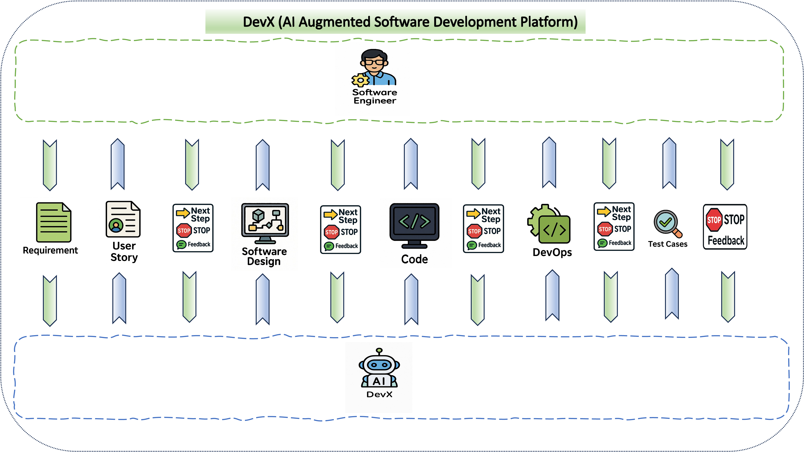

 

# DevX 1.0 🚀 *AI-Augmented Software Development Platform*

## Overview
DevX is transforming the way engineering teams build, debug, and optimize software. This platform demonstrates an AI-powered development workflow that leverages LlamaIndex to coordinate two advanced models: GPT-4o-mini for analyzing user input, and O3-Mini for tasks such as design, coding, DevOps, and more.

> ✨ Think of it as your Dev Co-Pilot—customizable, extensible, and ready.

## Key Features
- Multi-agent, event-driven architecture
- AI-assisted generation of user stories, designs, code, DevOps configurations, and test cases
- Feedback-driven refinement at every stage of the software development lifecycle

## System Flow

## 🌟 Core Capabilities
- 🧠 **Modular AI Flow**: Each step is handled by a dedicated LLM-powered agent
- ⚡ **LlamaIndex Integration**: Seamlessly connects prompts, data, and logic
- 🖥️ **Gradio UI**: Interactive, beautiful, and developer-friendly
- 🔌 **VS Code/IntelliJ Plugin**: Coming Soon
- 📚 **RAG Support**: Coming soon - Easily integrate Retrieval-Augmented Generation using org's internal knowledge

## 📦 Tech Stack
- OpenAI GPT-4 / GPT-3.5
- LlamaIndex
- Gradio
- Python 3.10+

## 🚀 Getting Started

1. Clone the repo
    
    git clone https://github.com/8806667653/DevX
    
    cd devx

2. Install dependencies

    pip install -r requirements.txt

## 🛠️ Contributing
We love contributions to DevX! Here's how you can help:

1. Fork the repository

2. Create your feature branch:

    git checkout -b feature/my-feature

3. Make your changes

    When editing Jupyter Notebooks, clear all outputs before committing

    Kernel > Restart Kernel and Clear All Outputs

4. Commit your changes:

    git add .
    
    git commit -m 'feat: add something cool'

5. Push to the branch:

    git push origin feature/my-feature

6. Open a Pull Request (PR)

    Include description of changes

    Ensure notebook runs without errors

    Tag maintainers for review

## 📄 License
This project is licensed under the MIT License – see the LICENSE file for details.

## 🙋‍♀️ Questions & Feedback
- Open an issue for bug reports or feature requests
- Connect with the maintainer:
  - LinkedIn: [Ashish K Jain](https://www.linkedin.com/in/ashish-k-jain/)
- Join our community discussions

The improvements made include:
1. Consistent heading hierarchy
2. Uniform emoji usage
3. Better spacing between sections
4. Standardized code block formatting
5. Cleaner list formatting
6. Consolidated similar information
7. More logical content flow
8. Removed redundant information
9. Consistent styling for emphasis and quotes

The new features may include:
1. Integration with RAG
2. VSCODE extention

Would you like me to explain any specific changes